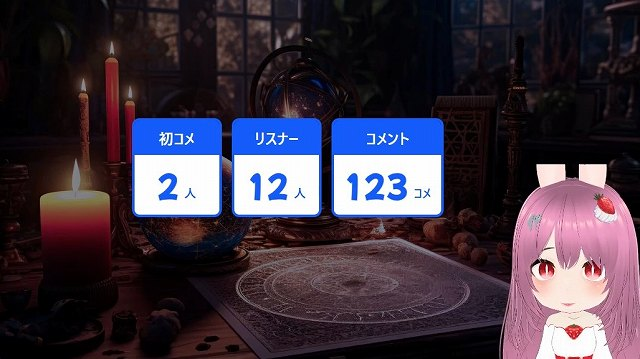
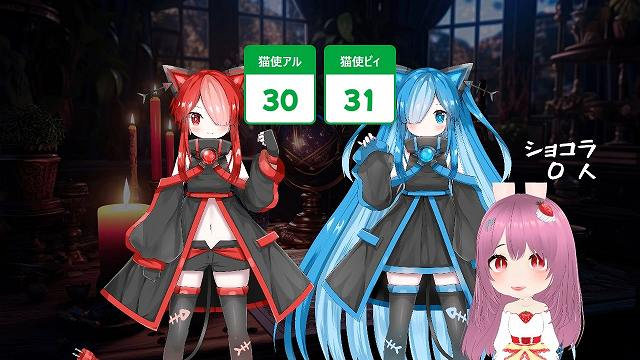
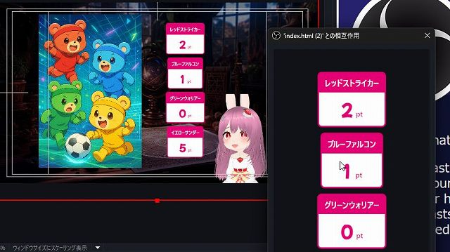
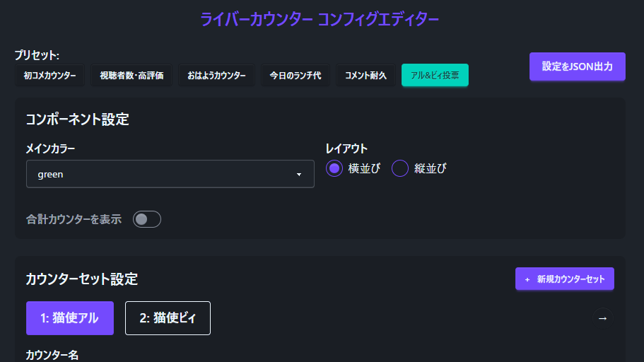

# リスナー掲示板 ListenerBBS v0.1.0

最終更新日：2025/04/16

OBS で使える、ライバー・配信者向けユーザーリストジェネレーターです。

## はじめに

- 本ソフトウェアの利用は自己責任でお願いいたします。
- 仕様は予告なく変更される場合があります。
- 商業利用を含め、自由にご利用いただけます。
- 一部 [わんコメ](https://onecomme.com/) の機能を利用しています

## 1.このカウンターでできること

### 🎬 一番配信に貢献したのは？個別のコメント回数・ギフト金額を一覧表示するジェネレーター

- ここに説明
- エンディング時(配信終了時)に一覧表示する
- 雑談でリストがどんどん増えていく

### 💬 主な機能

1. 🎮 **配信でコメントをしたユーザーリストを表示できる**
   - コメント数・同時視聴数・高評価数・ギフト金額などをカウント可能
   - 「カウントダウンモード」で目標数の設定も可能
   - 「合計カウンター」を使うことで、ポイントとしての表示も可能
2. 🎨 **テキストやカラーを自由にカスタマイズ可能なエディター付き**
   - エディター機能で直感的に編集が可能
   - プリセットから選ぶだけで簡単に設定
   - 10 種類のカラーバリエーションから選択可能
3. ▶️ **カウントの数値で音や映像を流せる**
   - カウントアップに応じて、WordParty を通じて効果音の再生が可能

## 2.導入方法

テンプレートの導入は、[テンプレートの導入方法](../install/readme_install.md) を御覧ください。

## 3. 使い方

### 3-1. カウンターを手動でカウントアップする

1. `index.html` のソースを右クリックし、「対話（操作）」を選択
2. カウンターが表示されるので操作する

#### 対話 (操作) での説明

- 🎯カウンターの手動操作
  - 左クリック：数字を 1 増やす
  - 右クリック：数字を 1 減らす

## 4. カスタマイズ

エディター(`configMaker.html`) が同梱されており、簡単に自作のカウンターを作成できます。

### 4-1. 編集を反映させる

1. 「config.js を生成」ボタンをクリック
2. 生成されたファイルを、`configMaker.html` と同じフォルダに上書き保存

### 4-2. 主な設定項目

#### 🧩 コンポーネント設定（Component Settings）

- 🎨 **メインカラー**：10 色から選択可能
- 📐 **レイアウト**：横並び／縦並びの切り替え
- ➕ **合計カウンターを表示**：カウンターセットの合計値を表示
  - 🏷️ **タイトル**：数値の名称（例：「今日のランチ代」など）
  - 🔢 **単位**：表示する単位（例：「円」など）

#### 🔢カウンターセット設定 (Counter Set Settings)

カウンターごとの設定。

- 🏷️ **カウンター名**：表示するカウンター名（例：「同時視聴数」など）

カウンター設定

- 🎯 **カウントモード**：わんコメが起動していない場合、自動的に「手動カウント」になります
  - ✋ **手動カウント**：手動で数値を調整
  - 💬 **コメント数**：対象コメント数をカウント
  - 👤 **ユーザー数**：対象コメントを投稿したユーザーの数をカウント
  - 🎉 **初コメ**：配信で初めてコメントしたユーザー数をカウント
  - 🎁 **ギフト金額**：スパチャ・ギフトの金額をカウント
  - 👀 **視聴者数**：配信中の視聴者数をカウント
  - 👍 **高評価数**：配信の高評価数をカウント
- 🎯 **カウント目標値**：1 以上を入力するとカウントダウンモードに切り替わります
- 🏷️ **単位名**：目標数の単位（例：「人単位」「円単位」など）
- 🧮 **倍率**：合計カウンター使用時に表示。倍率設定が可能です

#### 🎉WordParty 設定 (WordParty Settings)

カウントの増加で、わんコメに搭載されている「WordParty」を起動できます。

- 🔁 **カウントごとに発火する WordParty**：1 増加ごとに特定ワードの WordParty を再生
- 🎯 **目標達成時の WordParty**：カウントダウンが 0 になったときに発火
- 🎯 **特定数値で発火する WordParty**：指定したカウント到達時に発火

## 5. よくある質問

### 一般的な質問

**Q. わんコメとの連携は必須？**
A: OBS だけでも使えますが、手動でのみのカウントとなります。自動カウントを有効にするには、予め [わんコメ](https://onecomme.com/) を起動させて下さい。

**Q. OBS 以外の配信ソフトでも使えますか？**
A: HTML を表示できる配信ソフトであれば使用可能です（Streamlabs、XSplit など）。

**Q. カウンターの内容を変更するには？**
A: configMaker.html という、設定を変更できるファイルを用意しています。この readme の 4. カスタマイズ を参照して下さい。

### デザインや仕様など

**Q. カウンターはマイナス (0 未満) にできない？**
A.マイナスにならないようになってます。

**Q.個別にカラーを変更したい**
A. 現在のところ、カラーはすべて同じ色しか指定できません。ご了承ください。

**Q. カウンターのデザインを依頼できますか？**
A: 依頼可能です。詳細は BOOTH または Twitter でご連絡ください。

### トラブルシューティング

**Q. わんコメが起動していてもカウントされない**

A: 設定によっては、コメントテスターではカウントされないようになっています。

あるいは、わんコメより先に OBS を起動していると、「わんコメなしモード」となり、手動カウントのみの機能になります。その場合は、OBS を再起動するか、OBS の該当するソース＞プロパティから「現在のページのキャッシュ更新」を押して下さい。

**Q. 効果音が配信上で鳴らない**
A: 「obs 音が出ない」 で検索してみて下さい。

## クレジット

- 紹介画像のタイトルフォント: [サマサン・ドノクン | もじワク研究](https://moji-waku.com/samasan/)
- ReadMe の猫使アル/猫使ビィ: [猫使アル/猫使ビィ フリー立ち絵素材 - 猫使プロジェクト - BOOTH](https://booth.pm/ja/items/4628531)
- 紹介画像の背景: [魔法と予知 - チャプタールームでの呪術と占いの儀式の無料のAI画像素材 - ID.87050｜フリー素材 ぱくたそ](https://www.pakutaso.com/20230758187--.html)
- ReadMe の 4 色くまのイラスト: [ChatGPT](https://chatgpt.com/)
- フキダシとか: [ダーヤマ TOPECONHEROES](https://twitter.com/topeconheroes)

### 素材の取り扱いについて

- 素材の再配布は禁止されています。
- 素材の利用については、各配布サイトの利用規約をご確認ください。

## バージョン情報

### v0.1.0 (2025/04/16)

- 初期リリース

---

作成者：せすじピンとしてます @pintocuru

[Twitter](https://twitter.com/pintocuru) | [YouTube](https://www.youtube.com/@pintocuru)
