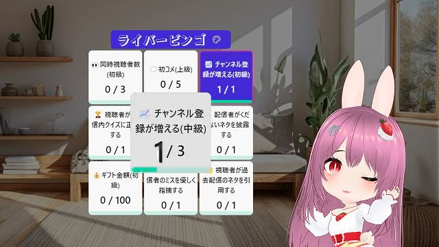
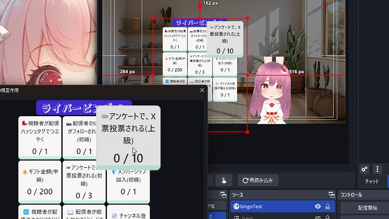
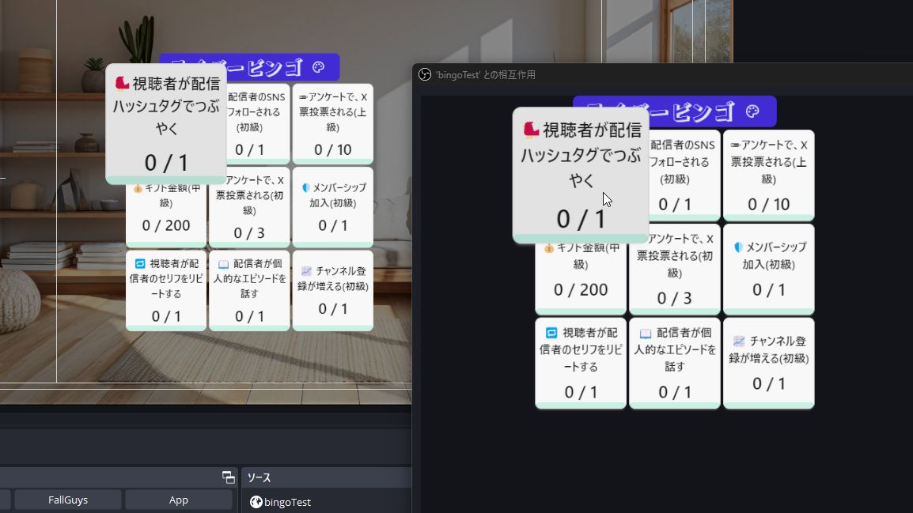

# ライバービンゴ LiverBingo v0.1.0

最終更新日：2025/03/28

OBS で使える、ライバー・配信者向けビンゴカードです。

## はじめに

- 本ソフトウェアの利用は自己責任でお願いいたします。
- 仕様は予告なく変更される場合があります。
- 商業利用を含め、自由にご利用いただけます。

## 1.このビンゴカードでできること

### 🎬 雑談配信に！OBS で操作できるビンゴカード

- 朝活・昼活・夕活等の雑談配信
- 企画配信

に最適なカウントダウンタイマーです！

### 💬 主な機能

1. 🎮 **OBS「対話モード」による直感的な操作性**
    - マウスひとつで、ビンゴのポイント増減が可能。
    - パネル変更やリセットも、ワンクリックで OK。
2. 🎨 **エディターによるテキスト・カラーの自由なカスタマイズ**
    - エディター付きで 編集しやすい。オリジナルビンゴカードを作成可能
    - 35 種類のテーマカラーから選択可能。
3. ⏳ **配信に最適化された視認性の高いデザイン**
    - カーソルを合わせると選択マスが拡大表示され、視認性が向上
    - ビンゴ達成で、ラインの色が鮮やかに変化

## 2.導入方法

テンプレートの導入は、[テンプレートの導入方法](../install/readme_install.md) を御覧ください。

## 3. 使い方

### 3-1. ビンゴカードを操作する

1. `index.html` のソースを右クリックし、「対話（操作）」を選択
2. ビンゴカードが表示されるので操作する

#### ビンゴカードの説明

- 🎯マス目の操作
	- 左クリック：数字を 1 増やす
	- 右クリック：数字を 1 減らす
	- 数字が 0 の時に右クリック：マスの内容をランダムに変更
- 🔧 **テーマ設定**
	- テーマカラーを変更可能（設定は保存されません）
	- テーマカラーは [DaisyUi](https://daisyui.com/docs/themes/) を使用しています
- 🃏 **タイトル**
	- 右クリック：ビンゴカードをリセット

## 4. カスタマイズ

エディター(`configMaker.html`) が同梱されており、簡単に自作のカードを作成できます。

### 4-1. 編集を反映させる

1. 「config.js を生成」ボタンをクリック
2. 生成されたファイルを、`configMaker.html` と同じフォルダに上書き保存

### 4-2. 主な設定項目

#### 基本設定 (Basic Settings)

- `🃏カードサイズ`: 3x3、4x4、5x5 から選択
- `🎨テーマ`: テーマカラーを変更

#### 固定項目 (Bingo Seeds)

各マスに入れるお題を個別に設定。

- `📝お題`: ビンゴカードの各マスに表示する目標
- `🎯達成目標`: 目標の達成に必要な回数、金額、人数など
- `📏単位`: 目標の単位。（例：10 人単位や、100 円単位など）

#### ランダム項目 (Bingo Random Seeds)

固定項目のお題が空白のマスに対して、ここからランダムに選択。

- `📝お題`: ビンゴカードの各マスに表示する目標
- `🎲出現割合`: 目標の出現確率。大きいほど出現しやすい。
- `🎯達成目標`: 目標の達成に必要な回数、金額、人数など
- `📏単位`: 目標の単位。（例：10 人単位や、100 円単位など）

## 5. よくある質問

### 一般的な質問

**Q. OBS 以外の配信ソフトでも使えますか？**
A: HTML を表示できる配信ソフトであれば使用可能です（Streamlabs、XSplit など）。

**Q. ビンゴの内容を変更するには？**
A: configMaker.html という、設定を変更できるファイルを用意しています。この readme の 4. カスタマイズ を参照して下さい。

### トラブルシューティング

**Q. 色が被って文字が見えづらい**
A: テーマカラーによっては、色が被ってしまい、見づらい事があるかもしれません。

**Q. 効果音が配信上で鳴らない**
A: 「obs 音が出ない」 で検索してみて下さい。

## クレジット

- すべての効果音: [効果音ラボ](https://soundeffect-lab.info/)
- 紹介画像のタイトルロゴ: [ガガガガ | ヤマナカデザインワークス](https://ymnk-design.com/12-2/)
- 紹介画像の背景: [シンプルなワンルームの無料のAI画像素材 - ID.36120｜フリー素材 ぱくたそ](https://www.pakutaso.com/20230809229oneroomDIS.html)

### 素材の取り扱いについて

- 素材の再配布は禁止されています。
- 素材の利用については、各配布サイトの利用規約をご確認ください。

## バージョン情報

### v0.1.0 (2025/03/28)

- 初期リリース

---

作成者：せすじピンとしてます @pintocuru

[Twitter](https://twitter.com/pintocuru) | [YouTube](https://www.youtube.com/@pintocuru)
