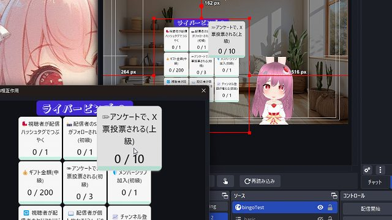
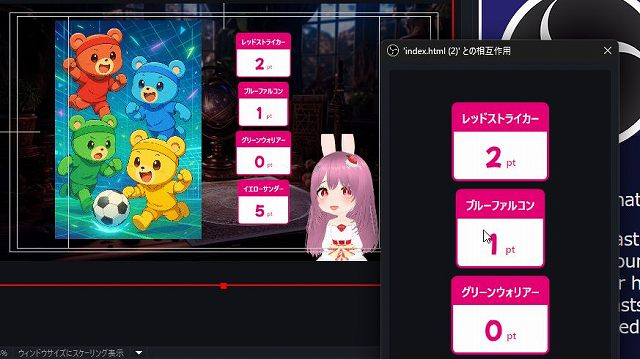

# ライバーカウンター LiverCounter v0.1.0

最終更新日：2025/04/13

このテンプレートは、下記のパッケージの内容を含みます。

- スナイプタイマーNextTimer Modern Set

OBS で使える、ライバー・配信者向け多機能カウンターです。

## はじめに

- 本ソフトウェアの利用は自己責任でお願いいたします。
- 仕様は予告なく変更される場合があります。
- 商業利用を含め、自由にご利用いただけます。
- 一部 [わんコメ](https://onecomme.com/) の機能を利用しています

## 1.このカウンターでできること

### 🎬 高評価も！特定のワードも！いろいろカウントできる多機能カウンター

- 同時視聴・高評価・ギフト金額のカウント
- 「おはよう」のカウント
- 投票カウント

など、わんコメの機能を使うことで、様々なシーンで使用できるカウンターです。

### 💬 主な機能

1. 🎮 **様々なカウントが可能な多機能カウンター**
    - コメント・同時視聴・高評価・ギフト金額などをカウントできます。
    - 「カウントダウンモード」で、目標数も設定できます
    - 「合計カウンター」を使うことで、ポイントとしての表示も可能。
2. 🎨 **エディターによるテキスト・カラーの自由なカスタマイズ**
    - エディター付きで 編集しやすい。
    - プリセットから選べて、設定しやすい。
    - 10 種類のカラーから選択可能。
3. ⏳ **カウントの数値で音や映像を流せる**
    - カウントアップごとに、WordParty を通じて効果音を流せます。

## 2.導入方法

テンプレートの導入は、[テンプレートの導入方法](../install/readme_install.md) を御覧ください。

## 3. 使い方

### 3-1. カウンターを手動でカウントアップする

1. `index.html` のソースを右クリックし、「対話（操作）」を選択
2. カウンターが表示されるので操作する

#### 対話 (操作) での説明

- 🎯カウンターの手動操作
	- 左クリック：数字を 1 増やす
	- 右クリック：数字を 1 減らす

## 4. カスタマイズ

エディター(`configMaker.html`) が同梱されており、簡単に自作のカウンターを作成できます。

### 4-1. 編集を反映させる

1. 「config.js を生成」ボタンをクリック
2. 生成されたファイルを、`configMaker.html` と同じフォルダに上書き保存

### 4-2. 主な設定項目

#### コンポーネント設定 (Component Settings)

- `🃏メインカラー`: 10 色のカラーから選択
- `🎨レイアウト`: 横並び・縦並びから変更
- `🎨合計カウンターを表示`: 「カウンターセット」の合計値を表示します。
	- タイトル: カウンターの数値名 (例: 今日のランチ代など)
	- 単位: 合計値の単位 (例: 円など)

#### カウンターセット設定 (Counter Set Settings)

カウンターごとの設定。

- `📝カウンター名`: カウンターの数値名 (例: 同時視聴など)

カウンター設定

- `🎯カウントモード`: わんコメが起動していない場合、自動的に「手動カウント」になります。
	- 手動カウント:
	- コメント数:「対象コメント設定」でフィルタリングしたコメント数をカウント
	- ユーザー数: 「対象コメント設定」でフィルタリングしたコメントを発言したユーザー数をカウント
	- 初コメ: 配信で初めてコメントをしたユーザー数をカウント
	- ギフト金額: 配信でプレゼントされたギフト/スパチャ金額をカウント。
	- 視聴者数: 配信の視聴者数をカウント
	- 高評価数: 配信の高評価数をカウント
- `📏カウント目標値`: 目標の単位。（例：10 人単位や、100 円単位など）
- `📏単位名`: 目標の単位。（例：10 人単位や、100 円単位など）
- `📏倍率`: 合計カウンター使用時のみ表示。合計カウンターの数値を倍率にします。

#### WordParty 設定 (WordParty Settings)

固定項目のお題が空白のマスに対して、ここからランダムに選択。

- `📝お題`: ビンゴカードの各マスに表示する目標
- `🎲出現割合`: 目標の出現確率。大きいほど出現しやすい。
- `🎯達成目標`: 目標の達成に必要な回数、金額、人数など
- `📏単位`: 目標の単位。（例：10 人単位や、100 円単位など）

## 5. よくある質問

### 一般的な質問

**Q. OBS 以外の配信ソフトでも使えますか？**
A: HTML を表示できる配信ソフトであれば使用可能です（Streamlabs、XSplit など）。

**Q. カウンターの内容を変更するには？**
A: configMaker.html という、設定を変更できるファイルを用意しています。この readme の 4. カスタマイズ を参照して下さい。

### トラブルシューティング

**Q. わんコメが起動していてもカウントされない
A: 設定によっては、コメントテスターではカウントされないようになっています。
あるいは、わんコメより先に OBS を起動していると、「わんコメなしモード」となり、手動カウントのみの機能になります。その場合は、OBS の該当するソース＞プロパティから「現在のページのキャッシュ更新」を押して下さい。

**Q. 効果音が配信上で鳴らない**
A: 「obs 音が出ない」 で検索してみて下さい。

## クレジット

- すべての効果音: [効果音ラボ](https://soundeffect-lab.info/)
- 紹介画像のタイトルロゴ: [ガガガガ | ヤマナカデザインワークス](https://ymnk-design.com/12-2/)
- 紹介画像の背景: [シンプルなワンルームの無料のAI画像素材 - ID.36120｜フリー素材 ぱくたそ](https://www.pakutaso.com/20230809229oneroomDIS.html)

### 素材の取り扱いについて

- 素材の再配布は禁止されています。
- 素材の利用については、各配布サイトの利用規約をご確認ください。

## バージョン情報

### v0.1.0 (2025/03/28)

- 初期リリース

---

作成者：せすじピンとしてます @pintocuru

[Twitter](https://twitter.com/pintocuru) | [YouTube](https://www.youtube.com/@pintocuru)
