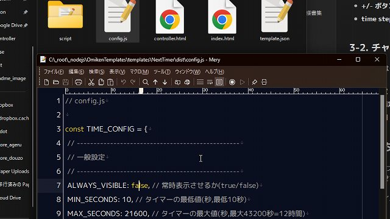

# スナイプタイマー NextTimer v0.2.2

最終更新日：2025/03/13

このテンプレートは、下記のパッケージの内容を含みます。

- スナイプタイマーNextTimer Modern Set

OBS で使える、ライバー・配信者向けカウントダウンタイマーです。

## はじめに

- 本ソフトウェアの利用は自己責任でお願いいたします。
- 仕様は予告なく変更される場合があります。
- 商業利用を含め、自由にご利用いただけます。
- 一部 [わんコメ](https://onecomme.com/) の機能を利用しています

## 1.このタイマーでできること

動作例: [YouTube動画を見る](https://www.youtube.com/watch?v=Z6ZN8FEDzp8)

### 🎬 OBS で簡単操作！配信を盛り上げるタイマー

- 視聴者参加型ゲーム
- 朝活・昼活・夕活
- 雑談の時間管理

などに最適なカウントダウンタイマーです！

### 💬 主な機能

1. 🎮 **OBS の「対話モード」でワンタッチ操作**
   - ボタン一つでタイマーをコントロール
   - 表示/非表示も簡単切替
2. 🎨 **見た目にこだわったデザイン**
   - オドメーター風の動きが楽しいカウントダウン
   - 複数のデザインから選べる
3. ⏳ **わんコメと連携で、チャットからタイマー操作**（オプション機能）
   - 配信者やモデレーターがコメントでタイマーを起動
   - 「11:20」「21 時 10 分 40 秒」「30 秒後」など柔軟な時間指定
4. 🔥 **わんコメの「WordParty」機能と連携**（オプション機能）
   - タイマー起動時や残り 10 秒などで効果音・演出を表示
   - カウントダウン終了時に動画や効果音で盛り上げる

## 2.導入方法

テンプレートの導入は、[テンプレートの導入方法](../install/readme_install.md) を御覧ください。

## 3. 使い方

### 3-1. コントローラーの操作方法

1. `controller.html` のソースを右クリックし、「対話（操作）」を選択
2. コントローラーが表示されるので操作する

#### ボタンの説明

- ▶️ **スタート**：カウントダウンを開始
- ⏹️ **ストップ**：カウントダウンを停止・リセット
- 👁️ **表示/非表示**：タイマーの表示・非表示を切替
- **+/- ボタン**：時間の増減
- **time step**：終了時刻を 10 秒/15 秒/20 秒/30 秒の区切りに調整

### 3-2. チャットでタイマーを操作する（わんコメ連携時）

配信者またはモデレーターが以下の形式でコメントするとタイマーが起動します：

- **時刻指定**：`12:34`、`12時34分`、`１２：３４`
- **分だけ指定**：`34分`（現在時刻の時間 + 指定した分）
- **相対時間 (秒または分)**：`30秒後`、`2分後`、`100分後`

## 4. カスタマイズ

`config.js` ファイルを編集してカスタマイズできます。 編集後は OBS を再起動して設定を反映させてください。

### 4-1. 主な設定項目

#### 一般設定

- `ALWAYS_VISIBLE`: 常時表示（`true`/`false`）
- `MIN_SECONDS`: 最小タイマー時間（秒）
- `MAX_SECONDS`: 最大タイマー時間（秒）
- `AFTER_SHOW`: 時間経過後の表示時間（秒）
- `SECOND_ADJUST`: 秒数調整の単位（秒）

#### わんコメ連携設定

- `COUNT_PARTY`: 特定秒数での WordParty 発火設定
- `COUNT_PARTY_START`: タイマー開始時の WordParty
- `COUNT_PARTY_FINISH`: タイマー終了時の WordParty
- `USER_ACCESS_LEVEL`: コメントでタイマー操作できるユーザーレベル（1: 誰でも～4: 配信者のみ）

## 5. よくある質問

### 一般的な質問

**Q. わんコメとの連携は必須？**
A: いいえ。OBS だけでも十分使えます。わんコメ連携するとコメントからの操作が可能になります。

**Q. 他の配信ソフトでも使えますか？**
A: HTML を表示できる配信ソフトであれば使用可能です（Streamlabs、XSplit など）。

**Q. 複数のタイマーを同時に表示できますか？**
A: 現在のバージョンでは 1 つのタイマーのみ対応しています。

### トラブルシューティング

**Q. タイマーがずれている**
A: タイマーは PC 時刻を参照します。PC 時刻が正確であることを確認してください。

**Q. 効果音が鳴らない**
A: タイマー自体に効果音機能はありません。わんコメの WordParty 機能を使ってください。詳細は [コメントによる演出 - WordParty](https://onecomme.com/docs/feature/wordparty) をご覧ください。

## バージョン情報

### v0.2.2 (2025/03/03)

- 内部の最適化

### v0.2.1 (2025/02/28)

- コメントによって正常に動かない不具合を修正
- 他、細かい点を修正

### v0.2.0 (2025/02/27)

- コントローラー機能追加（わんコメなしでも利用可能に）
- テンプレート開発キットを利用して再開発

### v0.1.0 (2024/09/27)

- 初期リリース

---

作成者：せすじピンとしてます @pintocuru

[Twitter](https://twitter.com/pintocuru) | [YouTube](https://www.youtube.com/@pintocuru)
