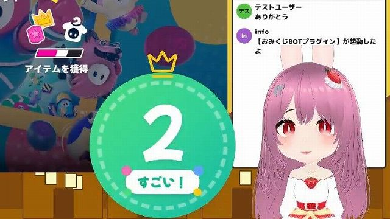
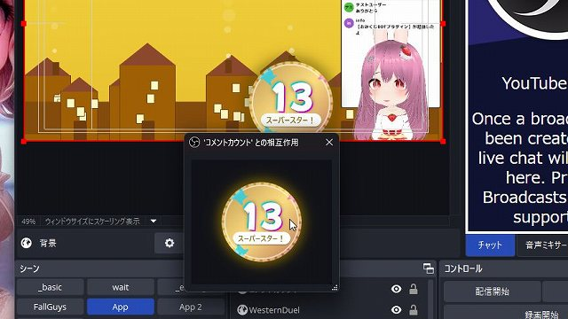
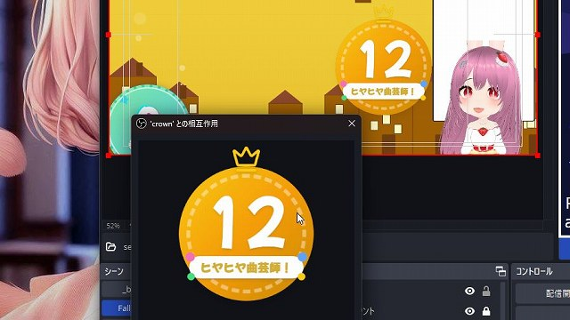
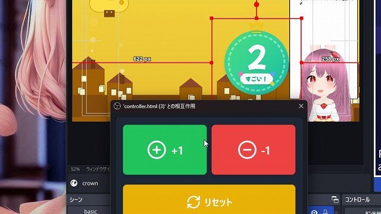

# ワードカウンター WordCounter v0.1.0

最終更新日：2025/03/13

このテンプレートは、下記のパッケージの内容を含みます。

- 勝数カウンター WordCounter VictoryCrown
- キルカウンター KillingCounter KillingSpree

OBS で使える、ライバー・配信者向けの、単一なカウンターです。

## はじめに

- 本ソフトウェアの利用は自己責任でお願いいたします。
- 仕様は予告なく変更される場合があります。
- 商業利用を含め、自由にご利用いただけます。
- 一部 [わんコメ](https://onecomme.com/) の機能を利用しています

## 1.このカウンターでできること

動作例: [YouTube動画を見る](https://youtu.be/o4L_J3rKu1A)

### 🎬 動く！アニメーションで配信を盛り上げるシンプルなカウンター

- 朝活・昼活・夕活
- 視聴者参加型ゲーム

などに最適な、シンプルなカウンターです。

配信者のためのコメントアプリ「[わんコメ](https://onecomme.com)」と併用すると、配信に合わせて自動でカウントする多機能なカウンターになります！

### 💬 主な機能

- 🎮 **OBS の「対話モード」でワンタッチ操作**
  - クリック・右クリックでカウンターをコントロール。
  - カウンター操作用のコントローラーも付属！
- 🎨 **こだわりのデザイン**
  - 見て楽しい、増えて嬉しいカウンター。
  - 複数のデザインから選択可能。
- ⏳ **わんコメと連携で多機能カウンターに進化！**
  - コメント数のカウントや特定ワードの集計が可能。
  - `config.js` を編集することでモードを切り替え可能。
- 🔥 **わんコメの「WordParty」機能と連携**（オプション）
  - カウント増加時や特定の数値で効果音・演出を再生。
  - 目標カウント達成時に動画や効果音で盛り上げる！

## 2.導入方法

テンプレートの導入は、[テンプレートの導入方法](../install/readme_install.md) を御覧ください。

## 3. 使い方

### 3-1. カウンターの操作方法

カウンター単体でも、OBS の「対話モード」を使うことで、カウンターの増減が行えます。

1. `index.html` のソースを右クリックし、「対話（操作）」を選択
2. カウンターの左クリックで「インクリメント」(数値が +1 される)
3. カウンターの右クリックで「デクリメント」(数値が -1 される)

### 3-2. コントローラーの操作方法

1. `controller.html` のソースを右クリックし、「対話（操作）」を選択
2. コントローラーが表示されるので操作する

#### ボタンの説明

- **+/- ボタン**：カウンターの増減
- ▶️ **リセット**：手動で増減させた数値を 0 にする

### 3-3. 配信で自動でカウントする（わんコメ連携時）

パッケージの設定によっては、下記の内容によって数値が変動します

- **コメント総数のカウント**：現在の配信の「コメントした総数」を数える
- **「初コメ」ユーザー数のカウント**：初めてコメントしたユーザー数を数える
- **「おはよう」のカウント**：現在の配信のコメントのうち、「おはよう」が含まれたユーザー数を数える
  - 同一ユーザーの複数「おはよう」はカウントしない設定も可能です
- **配信者の「👑」のカウント**：配信者やモデレーターが、専用のインクリメントコマンドをチャットすることで、OBS を操作しなくてもカウントしてくれます。

## 4. カスタマイズ

`config_**.js` ファイルを編集してカスタマイズできます。 パッケージにより名前は異なりますが、**中身はすべて同じ内容です。**

### 4-1. 一般設定

- **`TARGET`**: 目標となるカウント数。
- **`IS_LOOP`**: 目標達成後に色を変化させるかどうか。
- **`TEXTS_FIRST`**: count が初期値のテキスト
- **`STYLES_FIRST`**: count が初期値のカラー
- **`TEXTS`**: 数値が増えるたびに変化するテキスト。
  - 空 (`TEXTS:[]`) にすると、テキストの表示を消すことができます。
- **`TEXTS_AFTER`**: `TARGET` 達成後、ランダムで変化するテキスト。
- **`STYLES`**: 数値が増えるたびに変化するカラー。
  - 背景色は TailwindCSS を使用。詳細は「Tailwind チートシート」で検索。
- **`EASTER_MODE`**: イースターエッグ
  - パッケージによっては存在したり、しなかったりします。
  - `true` にすると、パッケージごとに異なる影響が発生します。

### 4-2. わんコメ連携設定

WordParty に関する設定。わんコメ稼働時のみ有効です。

- **`PARTY`**: 指定した秒数ごとに WordParty を発火する設定。
- **`PARTY_EVENT`**: カウント増加時（カウントモードが `commentDown` または `userDown` の場合は減算時）に発火する WordParty。
- **`PARTY_SUCCESS`**: カウントが `TARGET` に達した時に発火する WordParty。

### 4-3. 特殊な設定

- **`MULTIPLIER`**: count に掛け算をします。
  - 「1 コメに付きランチ代 5 円プラス」といった企画で使用できます。
- **`COUNT_MODE`**: カウントモード
  - `comment`: コメントを基準にカウントします。
  - `commentDown`: コメントを基準にカウントし、該当する場合は数値を減算します。
  - `user`: ユーザーを基準にカウントします。
  - `userDown`: ユーザーを基準にカウントし、該当する場合は数値を減算します。
  - `syoken`: 初コメモード。ユーザーを基準にカウントし、わんコメのユーザーリストに存在しない場合のみ増加します。
- **`ENABLED_SERVICES`**: 適用するプラットフォーム のリスト（すべて `OR` 条件）
  - `platforms` を指定すると、BOT のコメント
  - `!ID` を指定するとネガティブ条件となり、該当しない場合に適用されます。
- **`ALLOWED_IDS`**: 許可するユーザーID のリスト（すべて `OR` 条件）
  - `!ID` を指定するとネガティブ条件となり、該当しない場合に適用されます。
- **`ACCESS_LEVEL`**: ユーザーの役職を参照
  - `1`: すべてのユーザーが対象
  - `2`: 配信プラットフォームに「メンバー」区分がある場合、メンバー・モデレーター・配信者が対象
  - `3`: 配信プラットフォームに「モデレーター」区分がある場合、モデレーター・配信者が対象
  - `4`: 配信者のみ対象
- **`KEYWORDS`**: `ALLOWED_IDS` または `ACCESS_LEVEL` に該当するユーザーがコメントした際にインクリメントされるキーワード
  - すべて `OR` 条件
  - 正規表現が使用可能（正規表現については生成 AI に聞いてね！）

## 5. よくある質問

### トラブルシューティング

**Q. `config` の内容が反映されません**
A: カッコの閉じ忘れなどの記述ミスが原因でエラーが発生しやすいです。`config` の編集には VSCord などのエディターを使用することをおすすめします。

### デザインについて

**Q. `script` 内を編集してもいいですか？**
A: ソースコードは GitHub で公開していますが、サポートは提供していません。ライセンスは Apache 2.0 です。

**Q. カウンターのデザインを依頼できますか？**
A: 依頼可能です。詳細は BOOTH または Twitter でご連絡ください。

## バージョン情報

### v0.1.0 (2025/03/10)

- 初期リリース

---

作成者：せすじピンとしてます @pintocuru

[Twitter](https://twitter.com/pintocuru) | [YouTube](https://www.youtube.com/@pintocuru)
