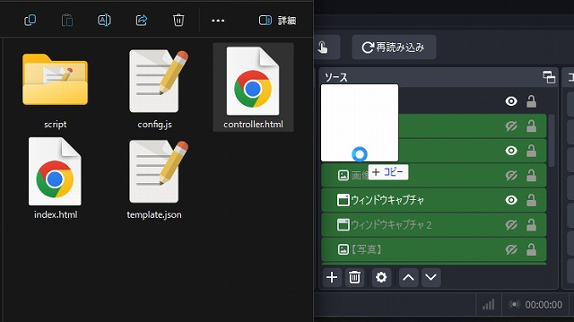
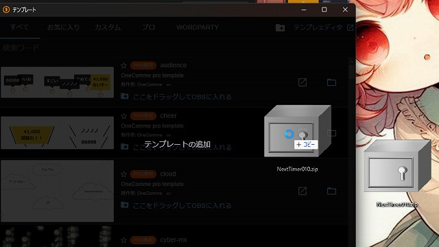
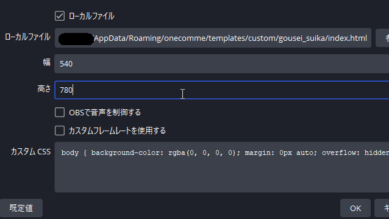
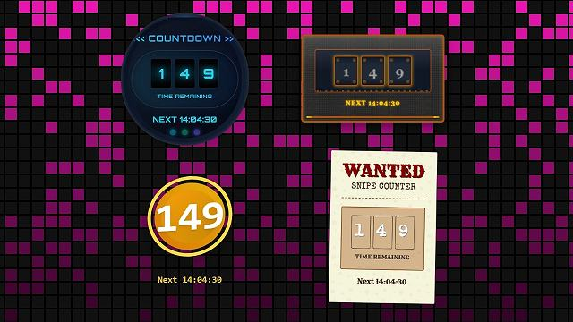
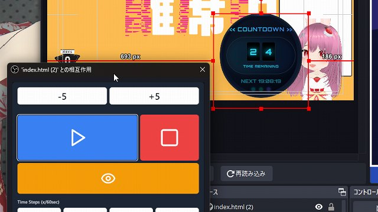

# ジェネレーター 共通の導入方法マニュアル

最終更新日：2025/03/09

## はじめに

- 各ジェネレーターの使用は自己責任でお願いします
- 商業利用も含め自由に利用できます
- 一部 [わんコメ](https://onecomme.com/) の機能を利用しています

## 導入方法

本プロジェクトには複数のパッケージが含まれていますが、基本的な導入手順は共通しています。

以下の手順に従ってセットアップを行ってください。

### 1-A. 基本的な導入方法（OBS のみ）

1. 使用したいパッケージのリリースページから zip ファイルをダウンロード
2. ダウンロードした zip ファイルを解凍
3. 使用する HTML ファイル (`index.html` など) を、OBS の「ソース」欄にドラッグ＆ドロップ

### 1-B. わんコメと連携する場合の導入方法

1. 使用したいパッケージのリリースページから zip ファイルをダウンロード
2. わんコメを起動（zip ファイルは解凍不要）
3. わんコメの右上【…】から「テンプレート」を選択
4. テンプレートウィンドウに zip ファイルをドラッグ＆ドロップ
5. 「ここをドラッグして OBS に入れる」の指示通り、OBS の「ソース」欄にドラッグ＆ドロップ
6. 「`index.html` 」でないファイルを読み込む場合は、入れたファイルのプロパティを開き、「ローカルファイル」の参照を押し、ファイルを変更します。

### 2-A. index.html の設定

1. ソースを右クリックして「プロパティ」を選択
2. 以下の 2 つにチェックを入れる
   - ✅ 表示されていないときにソースをシャットダウンする
   - ✅ シーンがアクティブになったときにブラウザの表示を更新する
3. 幅と高さを適切に設定

### 2-B. 「支援版」でスタイルを変更する

「支援版」には、デザインの異なる、複数の HTML ファイルが同梱されています。下記に従い、読み込むファイルを変更してください。

1. 「ローカルファイル」の「参照」をクリック
2. html と書かれた、任意のファイルを選択して開く
3. プロパティの下部にある「現在のページのキャッシュを更新」を押す

### 3. controller.html の設定

パッケージによっては、`controller.html` というカウンターを操作する HTML ファイルが同梱されています。上記に従い、予め `controller.html` を OBS にソースとして挿入して下さい。

1. ソースを右クリックして「プロパティ」を選択
2. 幅と高さを適切に設定
3. **重要：非表示にせず**、背景の後ろなどに配置しておく
4. また、「表示されていないときにソースをシャットダウンする」のチェックは外して下さい。

### 4. 設定のカスタマイズ

1. `config.js` を開き、各種設定を変更します。
   - 表示内容やフィルタリング内容をカスタマイズできます。
   - 設定項目の詳細については、各パッケージの README を参照してください。
2. 設定変更後、再読み込みして反映されることを確認します。

より詳しい手順や個別のパッケージに関する情報は、各パッケージの README をご覧ください。

### 5. よくある質問

#### 一般的な質問

**Q. わんコメとの連携は必須？**
A: コメントで動作させる機能は、わんコメが必須となります。コントローラーで操作できるパッケージでは、OBS だけでも十分使えます。

**Q. わんコメとのテンプレートとして導入しないと、わんコメの機能は使えない？**
A: いいえ、どのフォルダに設置しても、わんコメと連携が可能です。

**Q. 他の配信ソフトでも使えますか？**
A: HTML を表示できる配信ソフトであれば使用可能です（Streamlabs、XSplit など）。

#### トラブルシューティング

**Q. コントローラーを対話モードにしても表示されない**
A: `controller.html` は、「表示されていないときにソースをシャットダウンする」のチェックを外してください。

**Q. 表示されない/動作しない**
A: 何らかのエラーが起きているのかもしれません。コンソールログ（F12）でエラーが出ていないかチェックしてください。また、一報いただけると助かります。

**Q. 効果音が鳴らない**
A: ジェネレーター自体に効果音機能はありません。わんコメの WordParty 機能を使ってください。詳細は [コメントによる演出 - WordParty](https://onecomme.com/docs/feature/wordparty) をご覧ください。

---

作成者：せすじピンとしてます @pintocuru

[Twitter](https://twitter.com/pintocuru) | [YouTube](https://www.youtube.com/@pintocuru)
